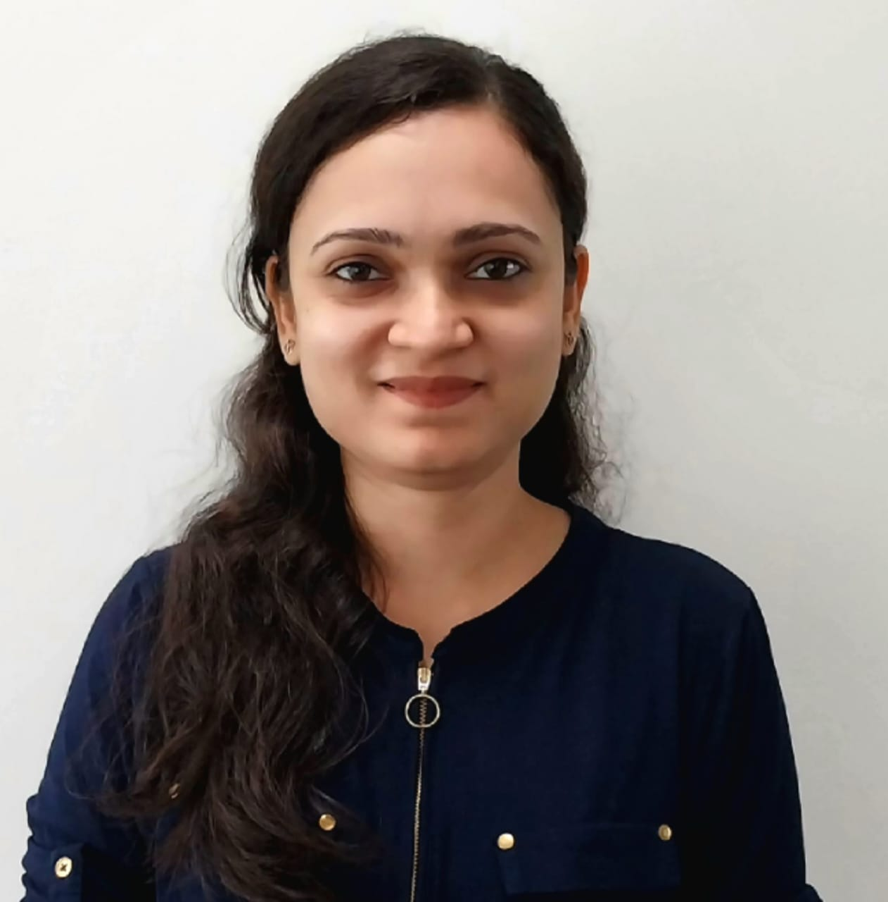

# 👋 About me

I am Poornima Jain, PhD student the Department of Artificial Intelligence at IIT-Hyderabad, supervised by Dr. Vineeth Balasubramanian. I have a keen interest in the low-level working of neural networks with a focus on applications for computer vision.

## 💼 EXPERIENCE

**MS-by-Research in Computer Science, IIIT-Bangalore	Aug 2019 – Dec 2022**  

I worked with Dr. Neelam Sinha and Dr. G. Srinivasaraghavan on an exciting problem of studying effects of complex-valued arithmetic in neural networks. My work included: 
- Explored the effects of using complex-valued arithmetic in neural networks for application in domains with complex-valued data, specially for the application of accelerated MRI Reconstruction
- Complex-valued gradient-based optimization algorithms, backpropagation, loss functions and neural network operations like convolution, dense layers and activation functions were studied. 
- A new complex-valued activation function, the PlaneReLU, was proposed to address limitations  of existing complex-valued activation functions.
- Experimented with end-to-end complex-valued operations in different SOTA network architectures for MRI Reconstruction - the AUTOMAP, the Primal Dual Net architecture and the Residual Robust Artificial neural network for k-space Interpolation (Residual RAKI) for Parallel MRI. Four datasets of single-coil and multi-coil (Parallel MRI) brain and knee k-space, from fastmri.org and other open-sources, were used.
- Complex-valued neural networks achieved improved or comparable performance w.r.t. standard SSIM, PSNR and NRMSE metrics in all experiments while using 50% fewer learnable parameters than real-valued networks.
- The improved learning in complex-valued neural networks was attributed to the regularization they cause by reducing the degrees of freedom in the neural network.

## 🎓 EDUCATION

***(Current) PhD in Artificial Intelligence, IIT Hyderabad	(July 2024 – present)***
- CGPA: 9/10
- Coursework: Foundations of Machine Learning, Advanced Data Structures and Algorithms, Deep Learning, Deep Generative Models, Computer Vision, Fraud Analytics using Predictive and Social Network Techniques

***MS-by-Research in Computer Science, IIIT Bangalore	(August 2019 – December 2022)*** 
-	CGPA: 3.82/4
-	Coursework: Machine Learning and Deep Learning, Linear Algebra, Convex Optimization, Random Walks and Markov Chains, Visual Recognition, Basic Computational Topology, Natural Language Processing
-	Thesis: “Complex-valued Neural Networks for MRI Reconstruction”
-	Teaching assistant for course SM202-Maths 4- Probability, Statistics and Complex Analysis for second year, I-MTech at IIIT-Bangalore
  
***B.Tech. in Computer Science Engineering, Visvesvaraya National Institute of Technology, Nagpur	(August 2014 – June 2018)***
-	CGPA: 8.36/10
-	Coursework: Operating systems, Data Structures and Algorithms, Database Management Systems, Computer Networks, Computer Architecture, Theory of Computation, Discrete Mathematics, Object-oriented Programming, Image and Video Processing, Parallel and Distributed Computing
-	B.Tech. Project Thesis: “Modelling, Simulation and Prediction of Stock Market data using Agent-based Modelling, Neural Networks and traditional regression methods”

***Class XII (PCM) Shivaji Science College, Nagpur (Maharashtra State Board)	June 2012 – June 2014*** 
-	Score: 90.92%
-	Top 1% in merit in Maharashtra State Board

***Upto Class X Bhartiya Vidya Bhavans, Civil Lines, Nagpur (CBSE)	May 2012***
-	Score: 99%
-	4th merit position in Nagpur division

## ACHIEVEMENTS
Won first place for presenting my M.S. thesis work at the Student Research Symposium at the 8th National Conference on Computer Vision, Pattern Recognition, Image Processing and Graphics (NCVPRIPG) held at IIT Jodhpur, India from 21-23 July 2023

## 🛠️ HOBBIES
I love cooking, practicing yoga and creative arts

## 📫 CONTACT

- GitHub: [jainspoornima]([https://github.com/yourusernam](https://github.com/jainspoornima/jainspoornima.github.io)e)  
- LinkedIn: [poornima-jain-79340222](https://www.linkedin.com/in/poornima-jain-793402227/)

